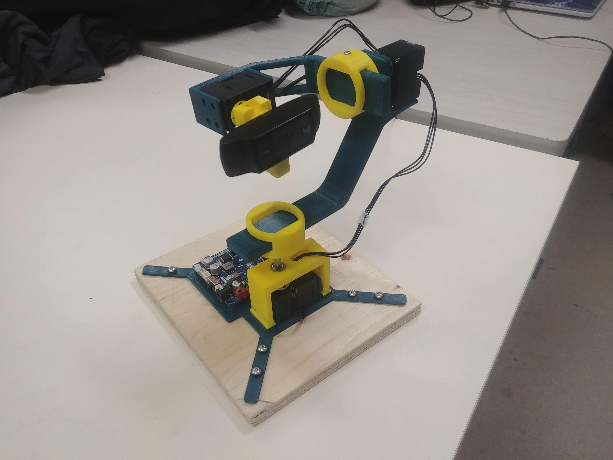
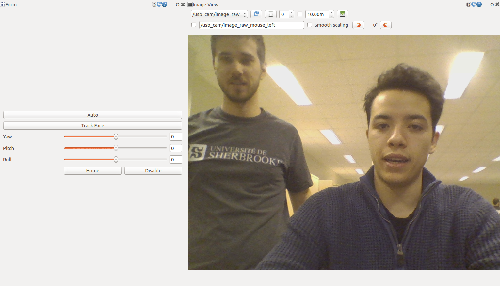

# Tracking camera

## Overview

Tracking camera : This package controls a 3 axis 3D printed gimbal using computer vision to track human faces and/or body. The gimbal can also be controlled manually via an rqt interface. Everything works in a ROS environnement. In this package, you can find all the mechanical parts needed to build our project as well as all the code to make it work. 



## Install

### Mechanical assembly

### OpenCR setup

To control the motors with ROS you’ll need to put the OpenCR board into a usb to dynamixel bridge. 

First, change your port permissions by typing this command line:

```bash
[user@machine ~]$ sudo usermod -a -G dialout user
```
Note that you have to logout/login to make the change available
.
Then follow the instructions [here](http://emanual.robotis.com/docs/en/parts/controller/opencr10/#arduino-ide) to make your board visible on Arduino IDE. You only have to follow the steps from 4. 1. Install on Linux to 4. 1. 5. 3. Port Setting

Now you can upload the following code File -> Examples -> OpenCR -> 10.Etc -> usb_to_dxl


### Software

For this project, you will need a computer or Jetson Xavier as well as an OpenCR. First of all, you need to have Ubuntu 18.04 installed on your computer as well as ROS Melodic. Here are the installation steps :
 
http://wiki.ros.org/melodic/Installation/Ubuntu

Dependencies:

1. darknet_ros
3. dynamixel_workbench
2. usb_cam

```bash
sudo apt-get install ros-melodic-dynamixel_workbench
sudo apt-get install ros-melodic-usb-cam
```
darknet_ros is not yet supported on Melodic, so you will need to build it from the source.

https://github.com/leggedrobotics/darknet_ros

After cloning our repository, build in your catkin workspace :

```bash
catkin_make
```

## Usage

Once everything is installed, run our project with

	roslaunch tracking_camera tracking_cam.launch

To run only manual mode

	roslaunch tracking_camera manual.launch


Here's what our user interface looks like when launched.



## Config files

Darknet config

* **darknet.yaml**     

Contains the camera configuration for darknet and which image topic to subscribe to.

Motors config

* **config_motors.yaml**     

Contains the motors configuration : IDs, names, etc.

Yolo config

* **yolov3.yaml**     

Contains yolo configuration : Accuracy threshold, classes to track.

## Nodes

### tracking_cam_plugin node

This is the only node in the package. It is a rqt plugin. You can control the gimbal manually using the UI sliders. It also subscribes to darknet and controls the gimbal to track faces when it is put in auto mode.

##### Subscribed Topics

* **`/dynamixel_workbench/dynamixel_state `** ([dynamixel_workbench_msgs/DynamixelStateList])

	Motors live states
	
* **`/darknet_ros/bounding_boxes `** ([sensor_msgs/NatSatFix])

	Position and dimension of detected objects

